## Why I built this

I built Owlverload because expiry-related stock handling in retail is often repetitive, manual, and easy to overlook.

In day-to-day store operations, staff have to keep track of products that are approaching expiry, decide when to apply discounts, remove expired items at the right time, and make sure nothing is missed on the shop floor. In practice, a lot of this work depends on memory, routine checks, and individual judgment.

That creates obvious operational risk. If expiry handling is missed or delayed, products can remain on shelves too long, follow-up actions may not happen consistently, and losses are harder to understand clearly afterward.

I wanted to build something that made this workflow more visible, more structured, and less dependent on manual attention alone.

This project was my attempt to turn a messy operational problem into a clearer system: one that helps staff act earlier, manage stock more directly, and capture better data around expiry outcomes.

## Early Wireframe Exploration

Before refining the implemented screens, I mapped the workflow in low-fidelity wireframes to think through screen transitions, stock-handling steps, and expiry-related flows.

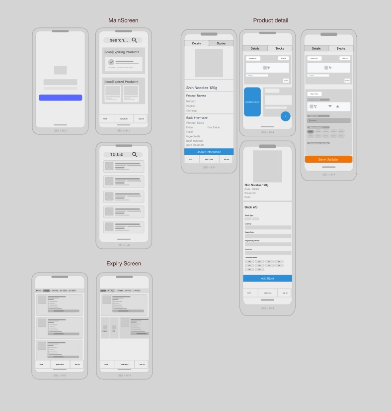

## App Screens

### 1. Entry and Sign-in
The app starts with a simple sign-in flow designed for quick access in day-to-day store operations.

  
  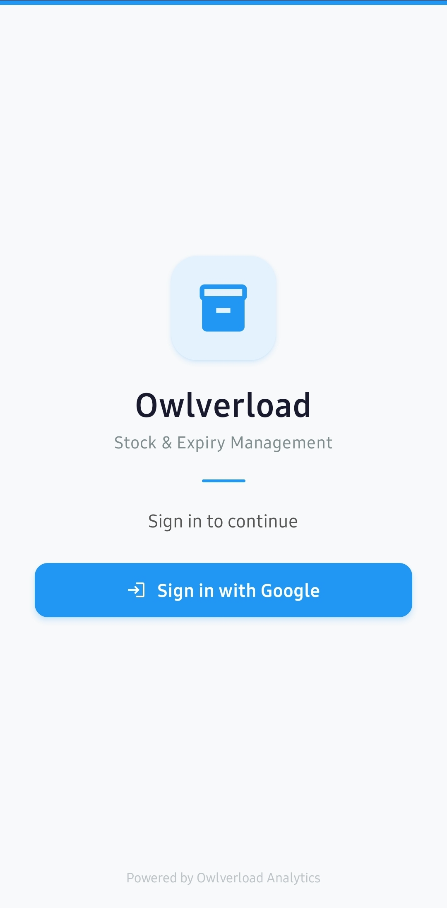

### 2. Home and Product Search
The home screen surfaces urgent expiry items and expired-product visibility immediately, reducing the chance that high-risk stock is missed during daily operations.

It also supports quick product lookup for fast in-store handling.

  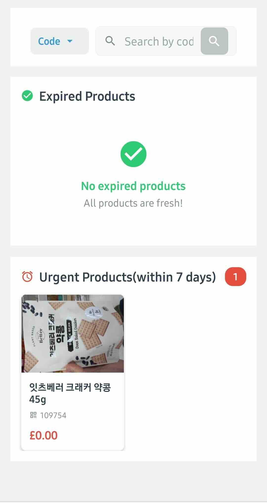
  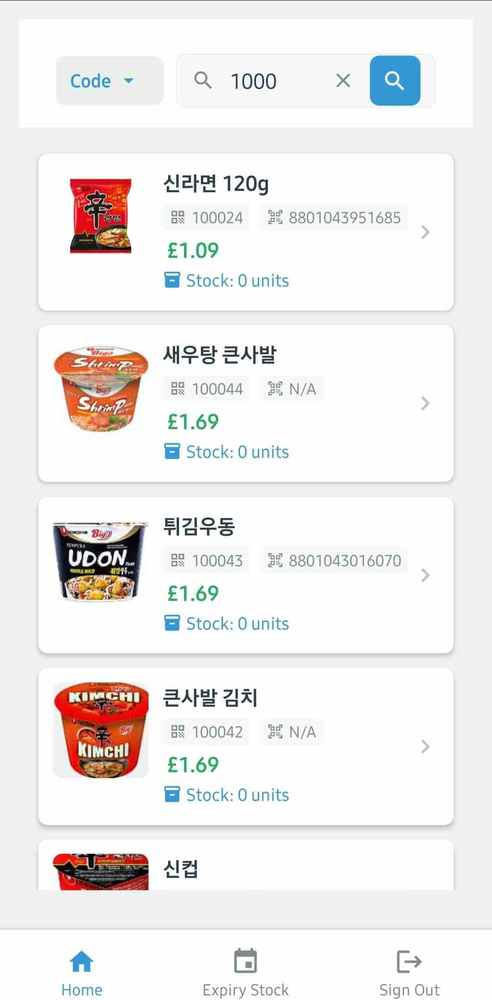

### 3. Product Details
The product detail screen provides core product information and acts as the entry point for stock-related actions.

  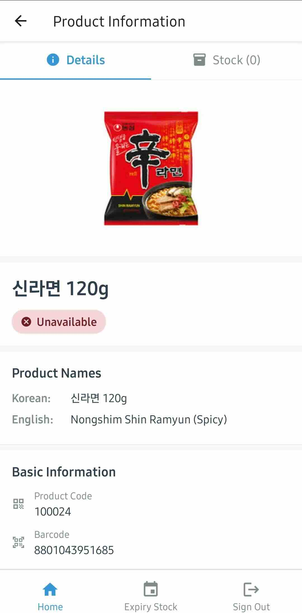

### 4. Stock Creation
Stock can be registered with quantity, expiry date, location, and optional discount information.

  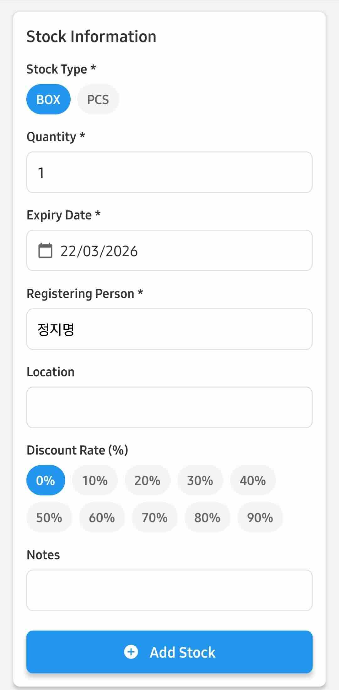

Working close to day-to-day retail processes made it clear that stock handling, expiry management, and product updates are often repetitive, error-prone, and dependent on manual checks. This app was built as a step toward making those workflows more visible, trackable, and manageable on mobile.

### 5. Stock Management Improvements
One of the main UI/UX improvements in this version was reducing the need to move into a separate stock detail step for common actions.

Users can now manage stock more directly from the stock list through swipe-based interactions and in-place editing flows.

  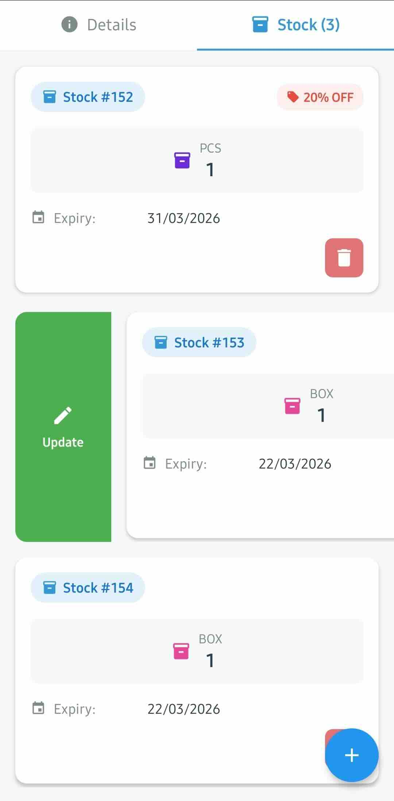
  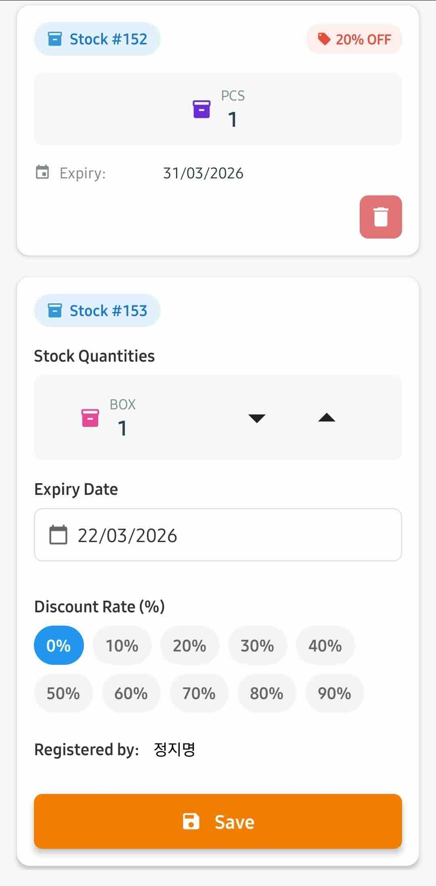

This change was intended to reduce taps, shorten repetitive workflows, and make operational stock handling more intuitive.
### 6. Expiry Tracking

The expiry tracking screen groups stock by time-to-expiry so staff can prioritise action more clearly.

This helps distinguish items that are approaching expiry from those that require immediate intervention.

  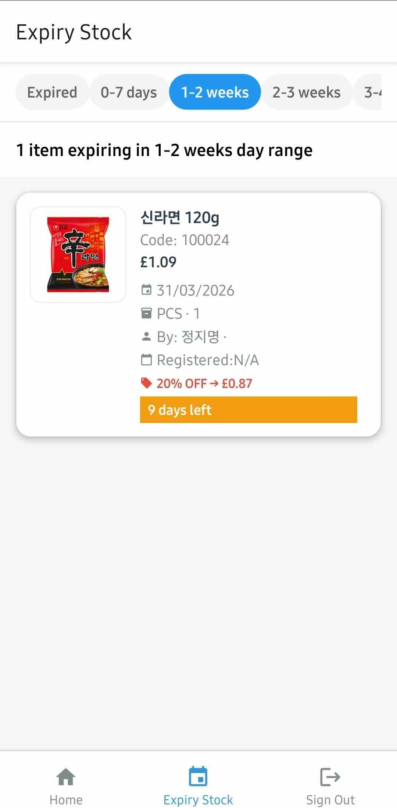
  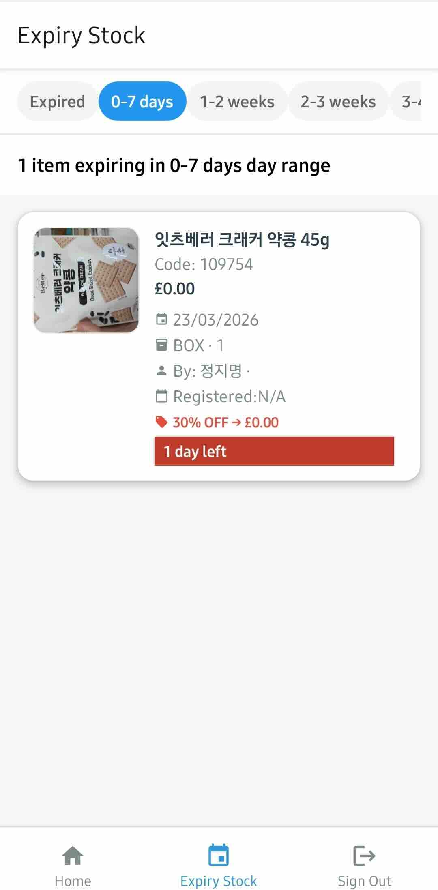

### 7. Expired Product Follow-up

A separate expired-products flow was added so items do not disappear from the operational workflow once they pass the expiry date.

This supports follow-up actions such as assessment, discount outcome tracking, and final loss handling.

  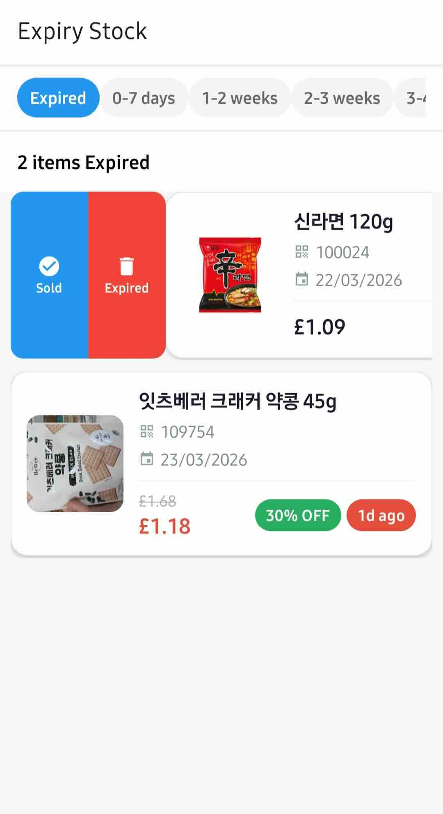

## Related project

This repository focuses on operational workflows in the mobile app.

For the reporting and dashboard side, see the separate project:
[inventory-ops-report](https://github.com/jimyeong/inventory-ops-report)